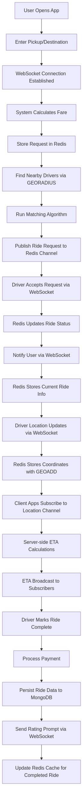

# Real-Time Ride-Booking System Architecture (Uber-like)

## Simplified High-Level System Architecture

*Note: The diagram above should show a simplified architecture with Redis as a central component and WebSockets for real-time communication.*

### Core Components:

1. **Client Applications**
   - Rider mobile app (iOS/Android)
   - Driver mobile app (iOS/Android)
   - Admin web dashboard

2. **Backend Server**
   - Express.js RESTful API framework
   - Socket.io for WebSocket communication
   - JWT-based authentication middleware
   - Winston for comprehensive logging

3. **Redis Implementation**
   - In-memory database for fast access (ioredis client)
   - Pub/Sub messaging for real-time events
   - Geospatial indexing for driver location tracking
   - Caching layer with redis-cache

4. **Primary Database**
   - MongoDB with Prisma ORM
   - Database-agnostic schema with Prisma schema language
   - Seamless migration capability to other databases
   - Geospatial indexes for location queries

5. **WebSocket Communication**
   - Socket.io for cross-platform WebSocket support
   - Redis adapter for Socket.io for horizontal scaling
   - Event-based architecture for real-time updates

## Database Choice: MongoDB with Prisma ORM

For this ride-booking system, we're using MongoDB with Prisma ORM for several key reasons:

1. **Flexible Schema Design**
   - Ride-booking data involves diverse entity types (users, drivers, rides) with evolving attributes
   - MongoDB's document model allows for schema evolution without downtime
   - New fields can be added without affecting existing records (e.g., adding new vehicle types)

2. **Geospatial Capabilities**
   - Built-in geospatial indexes and queries for finding nearby drivers
   - Support for GeoJSON data formats to represent complex routes and service areas
   - Efficient querying of location data without requiring specialized database systems

3. **Performance and Scalability**
   - Horizontal scaling through sharding for handling millions of rides and users
   - Compound indexes for efficient query patterns based on common access patterns
   - Read preferences to direct queries to secondaries for improved read scalability

4. **Future Migration Flexibility**
   - Prisma ORM enables database-agnostic data modeling
   - Same Prisma schema can work with PostgreSQL, MySQL, and other databases
   - Migration path to relational databases without rewriting application logic
   - Type-safe database queries regardless of underlying database

5. **High Availability**
   - Replica sets provide automatic failover for database nodes
   - Geographic distribution of replica set members for disaster recovery
   - Transactions for operations that must be atomic (e.g., payment processing)

## User Booking & Driver Matching Flow

1. **Ride Request Initiation**
   - User opens app and enters pickup/destination locations
   - WebSocket connection established for real-time updates
   - System calculates estimated fare and stores request in Redis

2. **Driver Discovery & Matching**
   - Redis Geo commands find nearby drivers based on geospatial index
   - Matching algorithm runs with Redis-cached driver data
   - Ride request published to Redis channel for matched drivers

3. **Ride Acceptance & Execution**
   - Driver accepts request via WebSocket
   - Redis updates ride status and notifies user via WebSocket
   - Redis stores current ride information for quick access

4. **Real-Time Tracking**
   - Driver location updates sent via WebSocket
   - Redis stores latest coordinates using geospatial commands
   - Client apps subscribe to location channel for live updates
   - ETA calculations performed server-side and broadcast to subscribers

5. **Ride Completion**
   - Driver marks ride complete via WebSocket
   - Payment processed and ride data persisted to MongoDB
   - Rating prompt sent through WebSocket connection
   - Redis cache updated for completed ride

## Redis Data Structures

### Driver Locations
- Geospatial sorted sets for storing driver coordinates
- Fast radius queries to find nearby drivers
- Time-based expiration for stale location data

### Active Rides
- Hash structures for storing ride details
- Sorted sets for prioritizing ride requests by time or importance
- Lists for queuing ride requests in high-demand situations

### User Sessions
- Key-value pairs for session storage with expiration
- JSON-encoded user data for quick access
- Session linking with WebSocket connections

### Real-time Channels
- Pub/Sub channels for real-time notifications
- Pattern-based subscriptions for different event types
- Broadcast capabilities for system-wide announcements

## Node.js Implementation with Recommended Packages

### Backend Framework
- **Express.js**: Fast, unopinionated web framework
- **Helmet**: Security middleware for HTTP headers
- **Compression**: Response compression
- **Cors**: Cross-origin resource sharing middleware

### WebSocket Implementation
- **Socket.io**: Real-time bidirectional event-based communication
- **@socket.io/redis-adapter**: Redis adapter for horizontal scaling
- **@socket.io/sticky**: Load balancer sticky sessions support
- **socketio-jwt**: Authentication middleware for Socket.io

### Redis Client
- **ioredis**: Robust, performance-focused Redis client
- **bull**: Redis-based queue for background jobs
- **rate-limiter-flexible**: Advanced rate limiting with Redis
- **redis-commander**: Admin UI for Redis monitoring (development)

### Prisma ORM Integration
- **@prisma/client**: Auto-generated and type-safe query builder
- **prisma**: CLI and development tools for database migrations
- **prisma-redis-middleware**: Prisma middleware for Redis caching
- **@prisma/extension-mongodb-geo**: Geospatial extension for MongoDB

### Monitoring & Logging
- **Winston**: Versatile logging library
- **morgan**: HTTP request logger middleware
- **Prometheus**: Metrics collection
- **Sentry**: Error tracking and monitoring

## Simplified Service Architecture

### 1. Core API Service
- **Functionality**: RESTful API endpoints for non-real-time operations
- **Technologies**: Express.js, Prisma Client, ioredis, zod for validation
- **Endpoints**: User registration, ride history, payments, ratings

### 2. WebSocket Service
- **Functionality**: Real-time communication and event handling
- **Technologies**: Socket.io, Redis pub/sub, JWT authentication
- **Events**: Location updates, ride status changes, chat messages

### 3. Matching Engine Service
- **Functionality**: Driver-rider matching algorithm
- **Technologies**: Node.js workers, Redis Geo commands, Bull queues
- **Process**: Find optimal driver match based on location and other factors

## Scaling Strategy with Redis

### Horizontal Scaling
- Multiple Express/Socket.io servers behind NGINX load balancer
- Redis Cluster for distributed data handling
- Sticky sessions for WebSocket connections via Socket.io-redis

### Redis Pub/Sub for Communication
- WebSocket servers subscribe to relevant Redis channels
- Messages published to Redis channels reach all server instances
- Enables server-to-server communication without direct connections

### Connection Management
- Redis stores session data with appropriate TTL
- Any server instance can handle any client with session lookup
- Connection count metrics tracked in Redis for auto-scaling decisions

### Fault Tolerance
- Redis Sentinel for high availability
- Socket.io reconnection strategy
- Data persistence to MongoDB for recovery scenarios

## Circuit Breaker & Retry Implementation

### Rate Limiting
- Redis-based rate limiting using rate-limiter-flexible
- Different limits for various API endpoints
- Sliding window algorithm for accurate rate tracking
- Custom response handling for limit exceeded cases

### Circuit Breaker
- Opossum or Hystrix-like circuit breaker patterns
- Redis-backed status tracking across multiple instances
- Configurable thresholds and reset timeouts
- Fallback mechanisms for degraded service modes

## Core Use Cases with Redis & WebSockets

### Rider Experience
1. **Request a Ride**
   - WebSocket connection established when app opened
   - Ride request sent and stored in Redis
   - Real-time status updates via WebSocket

2. **Track Driver Location**
   - Subscribe to dedicated Socket.io room for specific ride
   - Receive location updates through WebSocket
   - Map rendering with minimal delay

### Driver Experience
1. **Receive Ride Requests**
   - Socket.io notification with ride details
   - Accept/reject with immediate feedback
   - Navigation updates streamed in real time

2. **Update Location**
   - Send GPS coordinates through WebSocket
   - Redis Geo commands update driver position
   - Low latency updates (100-200ms intervals)

### System Benefits
1. **Low Latency Communication**
   - Direct WebSocket connection eliminates HTTP overhead
   - Redis in-memory operations reduce database load
   - Near real-time experience for users and drivers

2. **Simplified Deployment**
   - Node.js microservices can be containerized with Docker
   - Redis handles both caching and real-time messaging
   - PM2 or Kubernetes for process/container management
   - Reduced infrastructure costs while maintaining scalability

3. **Database Flexibility**
   - Prisma ORM allows for future database migrations
   - Start with MongoDB for document flexibility
   - Option to migrate to PostgreSQL or other SQL databases when needed
   - Zero downtime migrations with Prisma's migration engine
